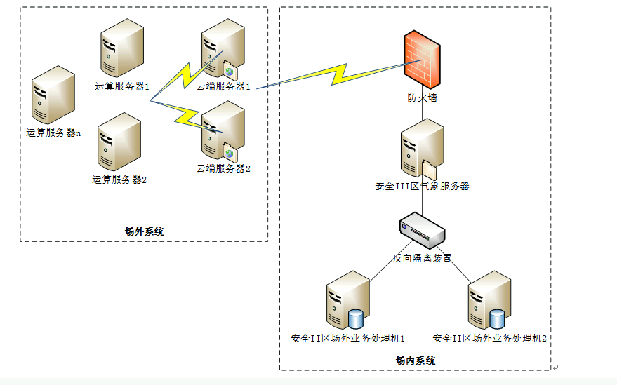

# wpfs20运算平台业务清单合成程序

 
 

**摘要**: 介绍业务清单合成程序的部署过程及配置文件常用配置说明。

 
 

**编写日期**: 2021-02-18

 

--------------------

## 目录

- [1. 程序在网络拓扑中的位置](#1)
- [2. 程序部署和配置文件说明](#2)

 

--------------------

 

## 1
## 程序在网络拓扑中的位置

 

 

> [返回目录](#目录)

 

## 2
## 程序部署和配置文件说明

 

见部署文档《2.0运算任务子系统v20.01.000版本安装部署说明20200826.doc》

 

> [返回目录](#目录)

 

