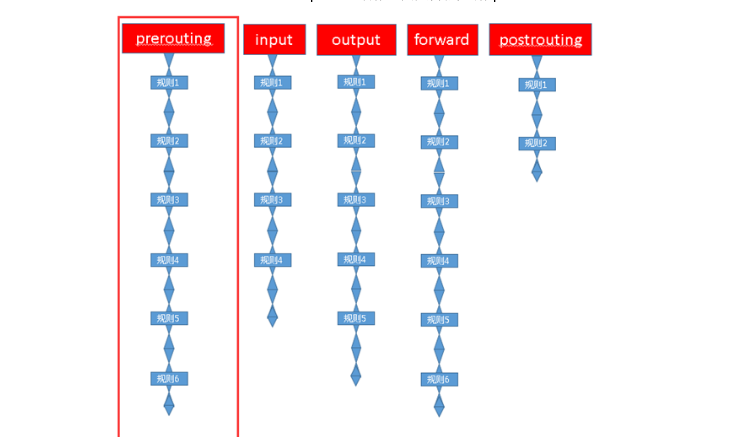
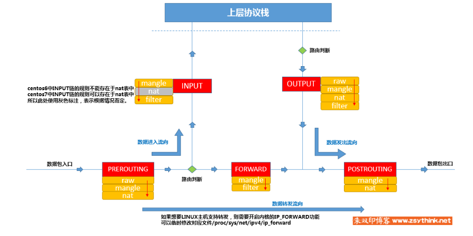
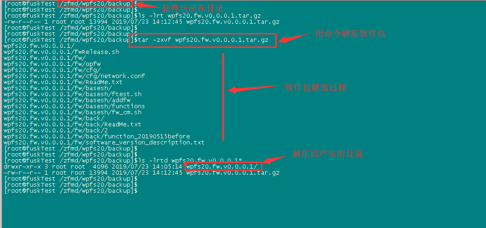
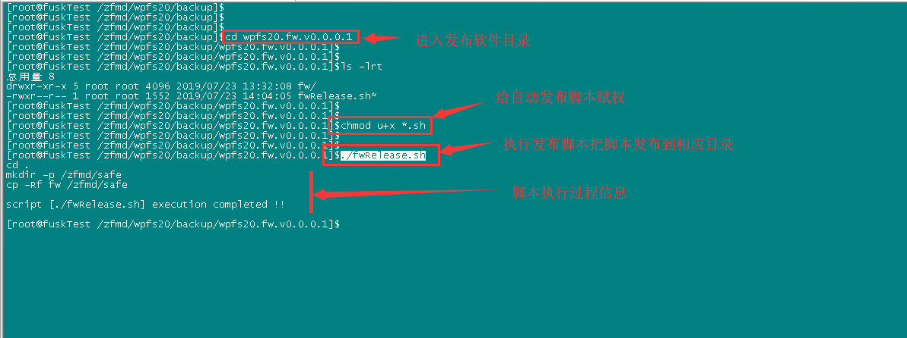
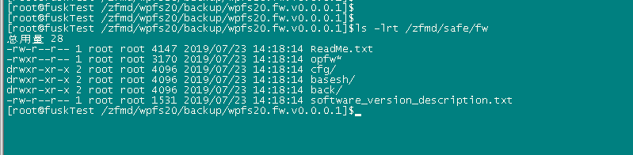
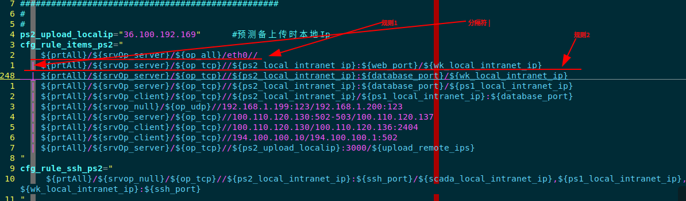
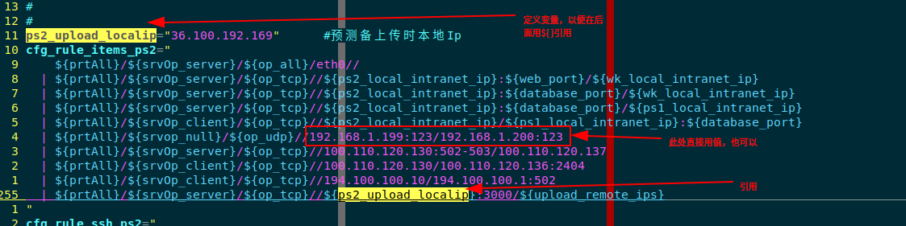

# iptables 基础知识及其配置脚本

</br>
</br>

**摘要**:
   接合wpfs20软件部署现场安防要求，及软件通信特点，介绍能用到的iptables基础知识、
iptables配置脚本的配置(根据wpfs20软件部署服务器特点定制)。

</br>
</br>

**编写日期**: 2021-02-05

</br>
</br>

--------------------

## 目录

- [1. iptables基础知识](#1)
   - [1.1 基本概念](#1_1)
   - [1.2 iptables 命令一般格式](#1_2)
   - [1.3 iptables规则管理](#1_3)
    > - [1.3.1 添加规则](#1_3_1)
    > - [1.3.2 删除规则](#1_3_2)
    > - [1.3.3 修改规则](#1_3_3)
    > - [1.3.4 保存规则](#1_3_4)
    > - [1.3.5 查看iptables表的规则](#1_3_5)
   - [1.4 iptables匹配条件总结](#1_4)
    > - [1.4.1 基本匹配条件](#1_4_1)
    > - [1.4.2 扩展匹配条件](#1_4_2)
        >> - [1.4.2.1 tcp扩展模块](#1_4_2_1)
        >> - [1.4.2.2 multiport扩展模块](#1_4_2_2)
        >> - [1.4.2.3 之udp扩展与icmp扩展](#1_4_2_3)
        >> - [1.4.2.4 扩展模块之state扩展](#1_4_2_4)
   - [1.5 黑白名单机制](#1_5)

- [2. fw配置脚本](#2)
   - [2.1 fw脚本的部署](#2_1)
   - [2.2 fw脚本的配置与使用](#2_2)
    > - [2.2.1 配置文件](#2_2_1)
    > - [2.2.2 配置文件中每一条规则的配置](#2_2_2)

</br>

--------------------

</br>

## 1
## iptables基础知识

iptables其实是一个命令行工具，位于用户空间，我们用这个工具操作真正的框架 netfilter( 位于内核空间,防火墙真正的安全框架。与大多数 的Linux软件一样, 这个包过滤防火墙是免费的,它可以代替昂贵的商业防火墙解决方)。

通常我们用iptables指代netfilter的功能。

iptables是按照规则来办事的,规则其实就是网络管理员预定义的条件。

规则一般的定义为"如果数据包头符合这样的条件,就这样处理这 个数据包"。

规则存储在内核空间的信息包过滤**表**中,这些规则分别指定了源地址、目的地址、传输协议(如TCP、UDP、ICMP)和服务类型
(如HTTP、FTP和SMTP)等。

当数 据包与规则匹配时,iptables就根据规则所定义的方 法来处理这些数据包,如放行(accept)、拒绝(reject)和丢弃(drop)等。

配置防火墙的主要工作就是添加、修改和删除 这些规则。

</br>

### 1_1
### 基本概念

1. 链

  如果我们想要防火墙能够达到"防火"的目的,则需要在内核中设置 关卡,所有进出的报文
都要通过这些关卡,经过检查后,符合放行条件的才能放行,符合阻拦条件的则需要被阻止,
于是,就出现了input关卡和output关卡, **而这些关卡在iptables中不被称为\"关卡\",而被称为\"链\"** 。

  现在,我们想象一下, 这些 "关卡" 在iptables中为什么被称作 "链" 呢? 我们知道, 
防火墙的作用就在于对经过的报文匹配 "规则", 然后执行对应的 "动作", 所以, 当报
文经过这些关卡的时候,则必须匹配这个关卡上的规则, 但是, 这个关卡上可能不止有一
条规则, 而是有很多条规则, 当我们把这些规则串到一个链条上的时候, 就形成了 "链",
所以, 我们把每 一个 "关卡" 想象成如下图中的模样, 这样来说, 把他们称为 "链" 更
为合适, **每个经过这个 "关卡" 的报文, 都要将这条 "链" 上的所有规则匹配一遍, 如果
有符合条件的规则,则执行规则对应的动作** 。



</br>


> [返回目录](#目录)

</br>

2. 表

  我们对每个 "链" 上都放置了一串规则, 但这些规则有些很相似, 比如, A类规则都是对IP或
者端口的过滤, B类规则是修改报文,那么这个时候,我们就引申出了表的概念: **我们把具有相同功能的规则的集合叫做"表"** 。 

  所以说, 不同功能的规则, 我们可以放置在不同的表中进行管理, 而iptables已经为我
们定义了4种表, 每种表对应了不同的功能, 而我们定义的规则也都逃脱不了这4种功能的
范围, 所以, 学习iptables之前, 我们必须先搞明白每种表 的作用。

  iptables为我们提供了如下规则的分类,或者说,iptables为我们提供了如下"表"

   -   filter表：负责过滤功能，防火墙；内核模块：iptables_filter   
   -   nat表：network address translation，网络地址转换功能；内核模块：iptable_nat   
   
   -   mangle表：拆解报文，做出修改，并重新封装 的功能；iptable_mangle   
   
   - raw表：关闭nat表上启用的连接追踪机制；iptable_raw

  我们自定义的所有规则, 都是这四种分类中的规则, 或者说, 所有规则都存在于
这4张 "表" 中, 但**最常用的是 filter表** 。

</br>

3. 链表关系

  但是我们需要注意的是, 某些 "链" 中注定不会包含 "某类规则", 就像某些 "关卡" 天生就不具备某些功能一样, 比如, A "关卡" 只负责打击陆地敌人,没有防空能力, 
B "关卡" 只负责打击空中敌人,没有防御步兵的能力, C "关卡" 既能防空, 也能防 
御陆地敌人, D "关卡" 海陆空都能防。

  从两个方面理解链与表的关系

  + 每个 "关卡" 或者说, 每个 "链" 与可以拥有的的 "表" 如下 :

    -   PREROUTING 的规则可以存在于：raw表，mangle表，nat表。
    
    -   INPUT 的规则可以存在于：mangle表，filter表，（ **centos7中还有nat表**，c entos6中没有）。
    
    -   FORWARD 的规则可以存在于：mangle表，filter表。
    
    -   OUTPUT 的规则可以存在于：raw表mangle表，nat表，filter表。
    
    -   POSTROUTING 的规则可以存在于：mangle表，nat表。     

  + 每个 "表" 可以存在对应的 "链" 如下 :
   
    -   raw 表中的规则可以被哪些链使用：PREROUTING，OUTPUT
    
    -   mangle 表中的规则可以被哪些链使用：PREROUTING，INPUT，FORWARD，OUTPUT，POSTROUTING
    
    -   nat 表中的规则可以被哪些链使用：PREROUTING，OUTPUT，POSTROUTING（centos7中还有INPUT，centos6中没有）
 
    -   filter 表中的规则可以被哪些链使用：INPUT，FORWARD，OUTPUT
   

   如果一个 "链" 中存在多个表，**优先级次序**（由高而低）如下：   

   `raw --> mangle --> nat --> filter`   

</br>

4. 数据经过防火墙的流程

  结合上述所有的描述,我们可以将数据包通过防火墙的流程总结为下图:

  


</br>

> [返回目录](#目录)

</br>

### 1_2
### iptables 命令一般格式

```shell
iptables [-t 表] -命令 匹配   操作
  命令                说明

  -P  --policy        <链名>  定义默认策略
  -L  --list          <链名>  查看iptables规则列表
  -A  --append        <链名>  在规则列表的最后增加1条规则
  -I  --insert        <链名>  在指定的位置插入1条规则
  -D  --delete        <链名>  从规则列表中删除1条规则
  -R  --replace       <链名>  替换规则列表中的某条规则
  -F  --flush         <链名>  删除表中所有规则
  -Z  --zero          <链名>  将表中数据包计数器和流量计数器归零
  -X  --delete-chain  <链名>  删除自定义链
  -v  --verbose       <链名>  与-L他命令一起使用显示更多更详细的信息
```
    
1. 匹配条件分为基本匹配条件与扩展匹配条件 

2. 处理动作:(常用的动作) 

-   ACCEPT：允许数据包通过。
  
-   DROP：直接丢弃数据包，不给任何回应信息，这时候客户端会感觉自己的请求泥牛入海了，过了超时时间才会有反应。

-   REJECT：拒绝数据包通过，必要时会给数据发送端一个响应的信息，客户端刚请求就会收到拒绝的信息。

-   SNAT：源地址转换，解决内网用户用同一个公网地址上网的问题。

-   MASQUERADE：是SNAT的一种特殊形式，适用于动态的、临时会变的ip上。

-   DNAT：目标地址转换。

-   REDIRECT：在本机做端口映射。

-   LOG：在/var/log/messages文件中记录日志信息，然后将数据包传递给下一条规则，也就是说除了记录以外不对数据包做任何其他操作，仍然让下一条规则去匹配。

</br>

> [返回目录](#目录)

</br>

### 1_3
### iptables规则管理

</br>

#### 1_3_1
#### 添加规则   

1. `命令语法：iptables -t 表名 -A 链名 匹配条件 -j 动作`   
    -A选项表示在对应链的末尾添加规则，省略-t选项时，表示默认操作filter表中的规则   
    示例：iptables -t filter -A INPUT -s 192.168.1.146 -j DROP
     
2. `命令语法：iptables -t 表名 -I 链名 匹配条件 -j 动作`    	 
    -I选型表示在对应链的开头添加规则    
    示例：iptables -t filter -I INPUT -s 192.168.1.146 -j ACCEPT

3. `命令语法：iptables -t 表名 -I 链名 规则序号 匹配条件 -j 动作`    
    在指定表的指定链的指定位置添加一条规则     
    示例：iptables -t filter -I INPUT 5 -s 192.168.1.146 -j REJEC

4. `命令语法：iptables -t 表名 -P 链名 动作`    
    设置指定表的指定链的默认策略（默认动作），并非添加规则    
    示例：iptables -t filter -P FORWARD ACCEPT   

</br>

#### 1_3_2
#### 删除规则

注意点：如果没有保存规则，删除规则时请慎重

1. `命令语法：iptables -t 表名 -D 链名 规则序号`   
	按照规则序号删除规则，删除指定表的指定链的指定规则，-D选项表示删除对应链中的规则。   
	示例：iptables -t filter -D INPUT 3

2. `命令语法：iptables -t 表名 -D 链名 匹配条件 -j 动作`   
    按照具体的匹配条件与动作删除规则，删除指定表的指定链的指定规则。   
    示例：iptables -t filter -D INPUT -s 192.168.1.146 -j DROP
 
3. `命令语法：iptables -t 表名 -F 链名`   
    删除指定表的指定链中的所有规则，-F选项表示清空对应链中的规则，执行时需三思。    
    示例：iptables -t filter -F INPUT

4. `命令语法：iptables -t 表名 -F`    
    删除指定表中的所有规则，执行时需三思。     
    示例：iptables -t filter -F
    

</br>

> [返回目录](#目录)

</br>

#### 1_3_3
#### 修改规则
    
1. `命令语法：iptables -t 表名 -R 链名 规则序号 规则原本的匹配条件 -j 动作`	   
    修改指定表中指定链的指定规则，-R选项表示修改对应链中的规则，使用-R选项时要同时指定对应的链以及规则对应的序号，并且规则中原本的匹配条件不可省略。     
    示例：iptables -t filter -R INPUT 3 -s 192.168.1.146 -j ACCEPT
    
2. 其他修改规则的方法：先通过编号删除规则，再在原编号位置添加一条规则。
  
3. `命令语法：iptables -t 表名 -P 链名 动作`   
    修改指定表的指定链的默认策略（默认动作），并非修改规则，可以使用如下命令    
    示例：iptables -t filter -P FORWARD ACCEPT


</br>

#### 1_3_4
#### 保存规则
    
表示将iptables规则保存至/etc/sysconfig/iptables文件中，如果对应的操作没有保存，那么当重启iptables服务以后
        
1.  service iptables save
    
2.  centos7中使用默认使用firewalld，如果想要使用上述命令保存规则，需要安装iptables-services,或者使用如下方法保存规则     
  `iptables-save > /etc/sysconfig/iptable`    
    可以使用如下命令从指定的文件载入规则，注意：重载规则时，文件中的规则将会覆盖现有规则。   
    `iptables-restore < /etc/sysconfig/iptables`
    


#### 1_3_5
#### 查看iptables表的规则

```shell
iptables -t 表名 -L
   查看对应表的所有规则，-t选项指定要操作的表，省略"-t 表名"时，默认表示操作filter表，-L表示列出规则，即查看规则。

iptables -t 表名 -L 链名
iptables -t 表名 -v -L
iptables -t 表名 -n -L
iptables --line-numbers -t 表名 -
iptables -t 表名 -v -x -L
iptables --line -t filter -nvxL
iptables --line -t filter -nvxL INPUT
```   

</br>

> [返回目录](#目录)

</br>

### 1_4
### iptables匹配条件总结

</br>


#### 1_4_1
#### 基本匹配条件
    
1.   -s 用于匹配报文的源地址,可以同时指定多个源地址，每个IP之间用逗号隔开，也可以指定为一个网段。     
    #示例如下    
    iptables -t filter -I INPUT -s 192.168.1.111,192.168.1.118 -j DROP    
    iptables -t filter -I INPUT -s 192.168.1.0/24 -j ACCEPT
    iptables -t filter -I INPUT ! -s 192.168.1.0/24 -j ACCEPT
    
2.   -d 用于匹配报文的目标地址,可以同时指定多个目标地址，每个IP之间用逗号隔开，也可以指定为一个网段。   
    #示例如下   
    iptables -t filter -I OUTPUT -d 192.168.1.111,192.168.1.118 -j DROP   
    iptables -t filter -I INPUT -d 192.168.1.0/24 -j ACCEPT   
    iptables -t filter -I INPUT ! -d 192.168.1.0/24 -j ACCEPT   
    
3.   -p 用于匹配报文的协议类型,可以匹配的协议类型tcp、udp、udplite、icmp、esp、ah、sctp等（centos7中还支持icmpv6、mh）。   
    #示例如下   
    iptables -t filter -I INPUT -p tcp -s 192.168.1.146 -j ACCEPT   
    iptables -t filter -I INPUT ! -p udp -s 192.168.1.146 -j ACCEPT   
    
4.   -i 用于匹配报文是从哪个网卡接口流入本机的，由于匹配条件只是用于匹配报文流入的网卡，所以在OUTPUT链与POSTROUTING链中不能使用此选项。   
    #示例如下   
    iptables -t filter -I INPUT -p icmp -i eth4 -j DROP   
    iptables -t filter -I INPUT -p icmp ! -i eth4 -j DROP   
    
5.   -o 用于匹配报文将要从哪个网卡接口流出本机，于匹配条件只是用于匹配报文流出的网卡，所以在INPUT链与PREROUTING链中不能使用此选项。   
    #示例如下   
    iptables -t filter -I OUTPUT -p icmp -o eth4 -j DROP   
    iptables -t filter -I OUTPUT -p icmp ! -o eth4 -j DROP   

</br>

> [返回目录](#目录)

</br>

#### 1_4_2
#### 扩展匹配条件

</br>

##### 1_4_2_1
##### tcp扩展模块

常用的扩展匹配条件如下：   
`-p tcp -m tcp --sport` 用于匹配tcp协议报文的源端口，可以使用冒号指定一个连续的端口范围   
`-p tcp -m tcp --dport` 用于匹配tcp协议报文的目标端口，可以使用冒号指定一个连续的端口范围   
    
    #示例如下
    iptables -t filter -I OUTPUT -d 192.168.1.146 -p tcp -m tcp --sport 22 -j REJECT
    iptables -t filter -I INPUT -s 192.168.1.146 -p tcp -m tcp --dport 22:25 -j REJECT
    iptables -t filter -I INPUT -s 192.168.1.146 -p tcp -m tcp --dport :22 -j REJECT
    iptables -t filter -I INPUT -s 192.168.1.146 -p tcp -m tcp --dport 80: -j REJECT
    iptables -t filter -I OUTPUT -d 192.168.1.146 -p tcp -m tcp ! --sport 22 -j ACCEP
 

</br>

   
##### 1_4_2_2 
##### multiport扩展模块
    常用的扩展匹配条件如下：
    -p tcp -m multiport --sports 用于匹配报文的源端口，可以指定离散的多个端口号,端口之间用"逗号"隔开
    -p udp -m multiport --dports 用于匹配报文的目标端口，可以指定离散的多个端口号，端口之间用"逗号"隔开
    
    #示例如下
    iptables -t filter -I OUTPUT -d 192.168.1.146 -p udp -m multiport --sports 137,138 -j REJECT
    iptables -t filter -I INPUT -s 192.168.1.146 -p tcp -m multiport --dports 22,80 -j REJECT
    iptables -t filter -I INPUT -s 192.168.1.146 -p tcp -m multiport ! --dports 22,80 -j REJECT
    iptables -t filter -I INPUT -s 192.168.1.146 -p tcp -m multiport --dports 80:88 -j REJECT
    iptables -t filter -I INPUT -s 192.168.1.146 -p tcp -m multiport --dports 22,80:88 -j REJECT

</br>

##### 1_4_2_3 
##### 之udp扩展与icmp扩展

**udp扩展**
    
    常用的扩展匹配条件
    --sport：匹配udp报文的源地址
    --dport：匹配udp报文的目标地址
    
    #示例
    iptables -t filter -I INPUT -p udp -m udp --dport 137 -j ACCEPT
    iptables -t filter -I INPUT -p udp -m udp --dport 137:157 -j ACCEPT
    #可以结合multiport模块指定多个离散的端口


    
**icmp扩展**
    
    常用的扩展匹配条件
    --icmp-type：匹配icmp报文的具体类型
    
    #示例
    iptables -t filter -I INPUT -p icmp -m icmp --icmp-type 8/0 -j REJECT
    iptables -t filter -I INPUT -p icmp --icmp-type 8 -j REJECT
    iptables -t filter -I OUTPUT -p icmp -m icmp --icmp-type 0/0 -j REJECT
    iptables -t filter -I OUTPUT -p icmp --icmp-type 0 -j REJECT
    iptables -t filter -I INPUT -p icmp --icmp-type "echo-request" -j REJECT

</br>

> [返回目录](#目录)

</br>
       
##### 1_4_2_4 
##### 扩展模块之state扩展
    
一说到连接，你可能会下意识的想到tcp连接，但是，对于state模块而言的"连接"并不能与tcp的"连接"画等号，在TCP/IP协议簇中，UDP和ICMP是
没有所谓的连接的，但是对于state模块来说，tcp报文、udp报文、icmp报文都是有连接状态的，我们可以这样认为，对于state模块而言，只要两台机器在"你来我往"的通信，就算建立起了连接.   

对于state模块的连接而言，"连接"其中的报文可以分为5种状态，报文状态可以为`NEW、ESTABLISHED、RELATED、INVALID、UNTRACKED`
    
```shell
#示例
  iptables -t filter -I INPUT -m state --state RELATED ESTABLISHED -j ACCEPT
```

</br>

### 1_5
### 黑白名单机制
    
如果使用白名单机制，我们就要把所有人都当做坏人，只放行好人( "链" 的默认策略设置成DROP)。

如果使用黑名单机制，我们就要把所有人都当成好人，只拒绝坏人( "链" 的默认策略设置成ACCEPT)。

一般来说，白名单机制更加安全一些，wpfs20的主机器采用的是白名单机制。
    
```shell

#示例如下
    
    iptables -P INPUT   DROP
    iptables -P OUTPUT  DROP
```

</br>

> [返回目录](#目录)

</br>

## 2
## fw配置脚本

  fw配置脚本是针对wpfs20服务器定制的可配置的iptables防火墙脚本，在服务器上部署完
脚本后，需要根据服务器的主机器名及需要放开的通信链路情况对脚本的配置文件进行修改，
最后执行脚本将相应防火墙则生效。

  > 注意：
  >   1. 此脚本只在”Red Hat Enterprise Linux Server release 6.7“系统上做过充分的
测试，非此版本的操作系统，不在此文档说明的范畴。
  >   2. 所有的操作在未特殊说明的情况下，都在root用户下进行。

</br>

### 2_1
### fw脚本的部署

1.  将软件包“wpfs20.fw.版本.tar.gz”拷贝到目录/zfmd/wpfs20/backup

2.  在/zfmd/wpfs20/backup目录下打开终端用命令解压软件包：
`tar –zxvf wpfs20.fw.版本.tar.gz`

  

3.  解压后将会出现：“wpfs20.fw.版本”的文件目录（文件夹），用命令进入
目录`cd wpfs20.fw.版本/`，执行命令`chmod u+x *.sh` 和 `./fwRelease.sh`，
进行软件自动部署

  

4.  查看配置是否发布到相应目录：
`ls -lrt /zfmd/safe/fw` 如有如图所示的文件内容则表示发布成功。

  


</br>

> [返回目录](#目录)

</br>

### 2_2
### fw脚本的配置与使用

</br>

#### 2_2_1
#### 配置文件

</br>

1. 文件头

  文件头的描述区域, 是固定格式不需修改。

```shell
#!/bin/bash
#
#
#############################################################################
#author       :    fushikai
#date         :    20190519
#linux_version:    Red Hat Enterprise Linux Server release 6.7
#dsc          :
#       Wind power prediction system 2.0linux system software firewall 
#       configuration file template
#
#    
#revision history:
#       v0.0.0.1  @ 20190723
#       2019-09-23 modify v0.0.0.1 version to V20.01.000
#       
#
#############################################################################


#此值判断文件是否已经加载，修改配置文件此不用修改此值
[ ! -z "${Already_loadedCfg_Flag}" ] && return 0
Already_loadedCfg_Flag=1


```

2. 主机名配置区域

```shell

###############################################################
#           主机名配置区域  
#   可以在服务器上打开终端执行: echo $HOSTNAME 得到
#   2.0系统的主机名在装系统时是固定的，一般不需要修改
###############################################################

#MY_HOSTNAME="fuskTest"          #要操作的服务器名傅世凯测试用的

MS_HOSTNAME="MeteoServer"          #气象服务器
PS1_HOSTNAME="PredictServer1"      #主预测服务器
PS2_HOSTNAME="PredictServer2"      #备预测服务器
SCA_HOSTNAME="ScadaServer"         #scada预测服务器
WK_HOSTNAME="WorkStation"          #工作站


```

  主机名配置区域，一般不需要修改，但有如下情况则之一则需要修改:

   - 在命令提示符执行`echo $HOSTNAME`与配置文件的不一样

         例如：在气象服务上执行echo $HOSTNAME后返回名为:meteTest则
         把MS_HOSTNAME="MeteoServer"改为MS_HOSTNAME="meteTest"

   - 在非标准的5台服务器(气象、scada、预测主、预测备、工作站)之外的服务上部署

         例如：在网关机器服务器上部署，则执行echo $HOSTNAME后返回名为:webnet则
         把MS_HOSTNAME="MeteoServer"改为MS_HOSTNAME="webnet"
           或
         把PS1_HOSTNAME="PredictServer1"改为PS1_HOSTNAME="webnet"
           或
         把PS2_HOSTNAME="PredictServer2"改为PS2_HOSTNAME="webnet"
           或
         把SCA_HOSTNAME="ScadaServer"改为SCA_HOSTNAME="webnet"
           或
         把WK_HOSTNAME="WorkStation"改为WK_HOSTNAME="webnet"
         

3. 调试总开关及可定制功能区域

```shell
###############################################################
#           
#   调试总开关及可定制功能区域
#  
###############################################################

#debugFlag=1 只输出将要配置的信息不实际写入系统；其他值则执行系统配置
debugFlag=1

#enablePing=1 开启ping功能,0关闭ping功能
enablePing=1

#enInterSsh=1 开启内网的ssh端口
enInterSsh=1

#bindNICByIP=1 根据配置的ip自动找对应的网卡号并进行绑定;0则不绑定
bindNICByIP=1

```

  这个区域需要根据实际情况来修改。

    例如:
      想要查看软件运行的情况，但不实际修改系统的设置，
      可把debugFlag的值设置为1，但在确定配置文件无误，
      并打算让设置生效时debugFlag须设置成0。

4. 规则功能定义区域

  >注意:
  >  此区域不需要修改

```shell
###############################################################
#           
#此脚本支持规则功能定义区域：【注】此区域建议不要修改除非软件升级 
#  
###############################################################

#outPrtFlag:产生规则的标识       0:OUTPUT,INPUT; 1:OUTPUT; 2:INPUT                 
prtAll=0
prtIn=2
prtOut=1

#server_opFlag:在连接状中是作为client还是server   0:client; 1:server; 2:client,server; 3:stat null
srvOp_client=0
srvOp_server=1
srvOp_all=2
srvop_null=3

#op_protocol:所用协议标识        tcp,upd,all
op_tcp="tcp"
op_udp="udp"
op_all="all"

```

5. 各主机配置配置规则区域

  此区域是与前面的”2.主机配置区域" 是对应的关系下面拿两个服其中两种情况举例，
其他情况以此类推: 

  (1) 如当前服务器的名配置在”主机配置区域“对应的是scada主机名，则配置规则
时在"各主机配置规则区域”找 “SCADA 服务器配置”;

  (2) 如当前服务器的名配置在”主机配置区域“对应的是气象主机名，则配置规则
时在"各主机配置规则区域”找 “气象服务器配置” ;

  此部门引用配置文件的内容以气象服务器服务举例:

```shell
##################################################
#                                                #
#             气象服务器配置                     #
#                                                #
#                                                #
##################################################
#

qx_local_fg_ip1="10.1.1.10"             #气象本地反隔ip1
qx_local_fg_ip2="10.1.2.10"            #气象本地反隔ip2
qx_local_extranet_ip="192.168.1.181"    #气象本地联外网的Ip
qx_ftp_server_ip1="42.121.65.50"        #气象ftp远程ip1
qx_ftp_server_ip2="182.254.227.250"     #气象ftp远程ip2
qx_fg_NIC_name1="p2p1"                   #气象反隔网卡号1
qx_fg_NIC_name2="p2p2"                   #气象反隔网卡号2

cfg_rule_items_qx="
    ${prtAll}/${srvop_null}/${op_udp}//${qx_local_extranet_ip}/:123
 |  ${prtAll}/${srvOp_client}/${op_tcp}//${qx_local_extranet_ip}/${qx_ftp_server_ip1}:21
 |  ${prtAll}/${srvOp_server}/${op_tcp}//${qx_local_extranet_ip}/${qx_ftp_server_ip1}:20
 |  ${prtAll}/${srvOp_client}/${op_tcp}//${qx_local_extranet_ip}/${qx_ftp_server_ip1}:1024-65535
 |  ${prtAll}/${srvOp_client}/${op_tcp}//${qx_local_extranet_ip}/${qx_ftp_server_ip2}:21
 |  ${prtAll}/${srvOp_server}/${op_tcp}//${qx_local_extranet_ip}/${qx_ftp_server_ip2}:20
 |  ${prtAll}/${srvOp_client}/${op_tcp}//${qx_local_extranet_ip}/${qx_ftp_server_ip2}:1024-65535
 |  ${prtAll}/${srvOp_client}/${op_all}/${qx_fg_NIC_name1}//
 |  ${prtAll}/${srvOp_client}/${op_all}/${qx_fg_NIC_name2}//
"


```

</br>

> [返回目录](#目录)

</br>

#### 2_2_2
#### 配置文件中每一条规则的配置

  配置文件中 | 分隔的以行为单位，一行为一个配置规则,只有一个规则时没有 | 分隔；有
多个规则时以 | 分隔, 整个条目用英文输入法的半角"号包括。

  如下图所示:

 

  条目配置则:

```shell
#
# 配置规则简要说明
#####################################
#    配置中凡是端口的配置都遵循的规则：
#    --------------------------------------------->
#    (1)可配单个端口号
#    (2)可配连续的端口号但需要用-线连接如 1024-65535
#    (3)可配多个不连接端口号用，号分隔如 20,21,1024-65535
#    <---------------------------------------------
#
#
#    配置配置条目时要遵循的规则：
#    --------------------------------------------->
#    所有的最终要用英文输入法中半角状态的双引号"括起来
#           每个条目的基本格式为: ${prtAll}/${srvOp_client}/${op_tcp}/网卡号/local_addr/remoteaddr
#           多个条目用 | 隔开，中间可以有换行或空格
#          
#          每个ip后如果有端口号则格式为 "ip:端口"
#          如果端口号是一个范围则配置为 "ip:端口1-端口2"
#          ip地址对中可以只有端口号但端口号之前的:不能省略
#    
#    <---------------------------------------------
#####################################


```

条目的固定格式为(以/分隔的6个固定的域）：

```
  产生规则的标识/客户或服务器标识/协议标识/本地网卡号/本地地址及端口/远程主机地址及端口
```

**其中前3个域即：生规则的标识/客户或服务器标识/协议标识 必须有值不能为空；**

**产生规则标识**：prtAll时既有OUTPUT也有INPUT链路规则

		      prtIn 只产生INPUT链路规则

		      prtOut只产生OUTPUT链路规则

（OUTPUT指本地通过网卡向外流通数据，INPUT指主机外部通本地网卡输入数据）

**客户或服务器标识**：srvOp_client 当前主机在此规则链中是作为客户端出现的

		          srvOp_server当前主机在此规则链中是作为服务端出现的

		          srvOp_all当前主机在此规则链中是既作为客户端又作为服务端出现的

                  srvop_null当前主机在规则链中的通信角色不确定

（通过客户或服务器标识，来限制连接链路的状态是state NEW,ESTABLISHED还是state ESTABLISHED）

**协议标识**：标识当前链路用的是tcp还是udp或者都允许

**本地网卡号**：可以为空，如果为空且bindNICByIP=1为时脚本会自动根据本地ip地址找对应的网卡号

**本地地址及端口**：可空，可只填写ip也可只填写端口（填写端口时：号不能省略），端口号可以是一个范围也可以是逗号分隔的多个端口号。

**远程地址及端口**：可空，可只填写ip也可只填写端口（填写端口时：号不能省略），端口号可以是一个范围也可以是逗号分隔的多个端口号。

  但“本地地址及端口”“远程地址及端口”不能同时为空
  
**特殊说明**: 我看配置文件里的配置规则中各个”域“是 "${字母}" 的形式，其实这不是必须
的，可以直接用值（如ip或端口），用"${字母}"是因为”字母"变量有可能有多个地方用到，
所以在规则前定义其值。


 

**配置规则**举例说明:

```shell
#截取的规则片断 
  | ${prtAll}/${srvOp_server}/${op_tcp}//198.122.0.1:502/198.122.0.200
  | ${prtAll}/${srvOp_client}/${op_tcp}//193.122.0.101/193.122.0.10:2404

  #第1条规则解释如下:
  #       配置一条进出网卡的链路信息，此链路本地端是通信链路里是服务端，
  #       协议是tcp,本地监听ip是198.122.0.1，监听端口是502，对端口ip是198.122.0.200
  #       没有端口限制
  #    典型的应用场景是：用modbus-tcp协议转发数据给远动

  #第2条规则解释如下:
  #       配置一条进出网卡的链路信息，此链路本地端是通信链路里是客户端，
  #       协议是tcp,远端监听ip是193.122.0.10，远端监听端口是2404，本地ip是193.122.0.101
  #       本地端没有端口限制
  #    典型的应用场景是：用104协议采集远动整场数据

```


</br>
</br>

> [返回目录](#目录)

</br>

