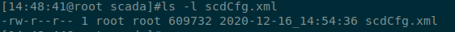

# wpfs20软件部署用到的一些linux基础知识介绍

</br>
</br>

**摘要**:
   接合wpfs20软件部署场景，对部署过程中能用到的一些linux目录、基础权限、
基础工具、命令进行简单的介绍。

</br>

**编写日期**: 2021-02-02

</br>
</br>

--------------------

## 目录

- [1. 与windows相比linux容易混淆的几个问题](#1)
- [2. 常用目录介绍](#2)
   - [2.1 常用的系统目录和目录作用](#2_1)
   - [2.2 zfmd软件目录](#2_2)
- [3. 文件编辑](#3)
   - [3.1 gedit编辑器编辑](#3_1)
   - [3.2 vim编辑器编辑](#3_2)
- [4. 常用命令](#4)
   - [4.1 常用权限命令](#4_1)
    > - [4.1.1 修改权限命令 chmod](#4_1_1)
    > - [4.1.2 修改所有者和所属组命令 chown](#4_1_2)
   - [4.2 常用目录和文件操作命令](#4_2)
   - [4.3 压缩和解压缩命令](#4_3)
   - [4.4 网络命令](#4_4)
   - [4.5 用户管理](#4_5)
   - [4.6 关机或重启及其他命令](#4_6)

</br>

--------------------

</br>

## 1
## 与windows相比linux容易混淆的几个问题

1. Linux 严格区分大小写

    Linux 是严格区分大小写的，所以操作时要注意区分大小写的不同，包括文件名和目录名、
命令、命令选项、配置文件设置选项等。

2. Linux 中所有内容以文件形式保存，包括硬件设备

    Linux 中所有内容都是以文件的形式保存和管理，硬件设备也是文件，这和windows完全
不同，windows是通过设备管理器来管理硬件的。Linux 的设备文件保存在/dev/目录中，
硬盘文件是/dev/sd[a-p]等。

3. Linux 不靠扩展名区分文件类型

    windows 是依赖扩展名区分文件类型的，比如,".txt"是文本文件、".exe"是执行文件、
".ini" 是配置文件。但 Linux 不是靠扩展名区分文件类型的，而是靠权限位标识来确定
文件类型的。常见的文件类型只有普通文件、目录、链接文件、声设备文件、字符设备
文件等几种。

    但 Linux 中的一些特殊文件还是要求写“扩展名“的，但是大家小心，并不是Linux一定要
靠扩展名来识别文件类型，而是为了帮助管理员来区分不同的文件类型。如
> 压缩包: \*.zip、\*.tar.gz、\*.tar
>
> 二进制软件包: \*.rpm
>
>shell脚本文件: \*.sh

4. Linux 中所有的存储设备都必须挂载之后才能使用

    Linux 中所有的存储设备都有自己的设备名，这些设备文件必须在挂载之后才能使用，
包括硬盘、U盘和光盘。挂载其实就是给这些存储设备分配盘符，只不过windows中的盘符
用英文字母表示，而在Linux中的盘符则是一个已经建立的**空目录**。我们把这些空目录
叫作挂载点（可以理解为windows的盘符),把设备文件（如/dev/sdb)和挂载点（已经建立
的空目录）连接的过程叫作挂载。

5. windows下的程序不能直接在Linux中使用

   Linux和windows是不同的操作系统，可以安装和使用的软件 也是不同的，所以能够在
windows中安装的软件是不能在Linux中安装的。 

</br>

> [返回目录](#目录)


## 2
## 常用目录介绍

这里只介绍我们经常用到的一些系统目录，和zfmd软件部署涉及的公共目录。

</br>

### 2_1
### 常用的系统目录和目录作用

  |目录名|目录的作用|
  |------|----------|
  |/usr/|系统软件资源目录，usr可以理解成"UNIX Software Resource"。系统中安装的软件大多数保存在这里|
  |/dev/|设备文件保存位置|
  |/home/|**普通用户**的宿主目录。在创建用户时。每个用户要有一个默认登录和保存自己数据的位置，就是用户的宿主目录。如zfmd用户的宿主目录为/home/zfmd; oracle用户的宿主目录为/home/oracle|
  |/root/|root用户的宿主目录。普通用户的宿主目录在/home/下|
  |/media/|挂载目录，一般用来挂载媒体设备的，如:光盘|
  |/mnt/|挂载目录，建议挂载媒体设备之外的设备|
  |/etc/|配置文件保存位置,系统内所有采用默认安装方式(rpm安装)的服务配置文件全部保存在此目录中，如用户信息、服务的启动脚本、常用服务的配置文件等|
  |/tmp/|临时目录。一些存放临时文件的目录，在该目录下，所有用户都可以访问和写入|
  |/proc/|虚拟文件系统。该目录中的数据并不保存在硬盘上，则是保存到内存中。主要保存系统的内核、进程、外部设备状态等。如/proc/cpuinfo是保存CPU信息的，/proc/devices是保存设备驱动的列表|
  |/var/|动态数据保存位置。主要保存缓存、日志及软件运行所产生的文件|
  |/var/spool/cron/|系统的定时任务队列保存位置。如root用户的定时任务文件/var/spool/cron/root,   zfmd用户的则为/var/spool/cron/zfmd|

</br>

### 2_2
### zfmd软件目录

  |目录名|目录的作用|
  |------|----------|
  |/zfmd/|zfmd软件基准目录|
  |/zfmd/firefox/|Firefox软件目录|
  |/zfmd/tomcat/|tomcat软件目录|
  |/zfmd/oracle/|Oracle安装目录|
  |/zfmd/syskeeper2000/|反隔软件目录|
  |/zfmd/safe/|iptables软件防火墙脚本目录|
  |/zfmd/tmp/|临时文件目录|
  |/zfmd/wpfs20/|风功率2.0基准目录|
  |/zfmd/wpfs20/lib/|风功率2.0库目录|
  |/zfmd/wpfs20/startup/|启动软件脚本系统目录|
  |/zfmd/wpfs20/backup/|风功率2.0备份目录|
  |/zfmd/wpfs20/lib/|风功率2.0库目录|


</br>

> [返回目录](#目录)


## 3
## 文件编辑

</br>

### 3_1
### gedit编辑器编辑

有2种方法使用gedit编辑文件：鼠标右键和终端命令

   1. 在图形界面窗口找到文件，右键单击要编辑的文件先把相应的选项进行编辑
   2. 在命令窗口用gedit
     - 满足如下条件:
     > 1. 需要登录服务器的图形界面，不可远程登录操作.
     > 2. 系统中有gedit编辑器即：用命令which gedit有正常的返回.
     - 打开文件在终端中输入如下命令:`gedit 带路径的文件名`

</br>

### 3_2
### vim编辑器编辑

vim编辑器有极为丰富的功能，且几乎不受使用场景的限制，但操作命令也繁多；这里只根
据使用场景介绍几种“傻瓜”式的操作序列，在遇到相关场景时可以按需要组合对应操作序列
即可。

1. 打开文件

```
  vim  文件名 #文件名如果不在当前路径则需要加路径
```

2. 退出文件

```
 (1) 按2次键盘上的 Esc 键
 (2) 输入 :q 然后回车
```

3. 保存文件

```
 (1) 按2次键盘上的 Esc 键
 (2) 输入 :w 然后回车
```

4. 在打开的文件中移动光标

```
 (1) 按2次键盘上的 Esc 键
 (2) h键:光标左移；l(小写的L)键:光标右移；k键:光标上移；j键:光标下移；
```

5. 在打开的文件中光标前插入内容

```
 (1) 按2次键盘上的 Esc 键
 (2) i键
 (3) 输入或粘贴自己想要的内容
 (4) 按2次键盘上的 Esc 键
```

6. 在打开的文件中查找某个内容

```
 从光标处向文件尾搜索
 (1) 按2次键盘上的 Esc 键
 (2) /要查找的内容  按回车
 (3) n键 光标移到下一个匹配处

 从光标处向文件头搜索
 (1) 按2次键盘上的 Esc 键
 (2) ?要查找的内容  按回车
 (3) n键 光标移到下一个匹配处
```

7. 在打开的文件中定位到某个行号上

```
 (1) 按2次键盘上的 Esc 键
 (2) :数字行号  回车
```

</br>

> [返回目录](#目录)


</br>

## 4
## 常用命令

这里只介绍我们部署软件能用到的一些常用命令及涉及的背景知识介绍。

</br>

### 4_1
### 常用权限命令

在服务器上，绝对不是所有的用户使用root身份登录，而要根据不同的工作需要，合理分配
用户等级和权限等级。如:zfmd软件运行的服务器上有root、zfmd、oralce、gzz等用户。

文件的普通权限分为3组：所有者、所属组和其他人。对应到我们工作实际情况，**一般只需要
关注“所有者”的权限即可**。

查看文件的权限可以用ls命令查看



文件类型位常用的含义:
- "-": 普通文件
- "d": 目录文件。Linux中一切皆文件，所以目录也是文件的一种

权限位各符号代表的含义:
- "r": 代表read,是读取权限
      针对普通文件来说:代表可以读取文件中的数据，即可以用 cat、more等命令查看内容
      针对目录文件来说:代表可以查看目录下的内容，也就是可以查看子文件和子目录
- "w": 代表write,是写权限
      针对普通文件来说:代表可以修改文件中的数据
      针对目录文件来说:代表可以在目录中新建、删除、复制、剪切子文件或子目录
- "x": 代表excute,是执行权限
      针对普通文件来说:代表文件拥有了执行权限，可以运行
      针对目录文件来说:代表可以进入目录，对应到命令就是可以用cd进入目录

</br>

#### 4_1_1
#### 修改权限命令 chmod

命令格式:

```
chmod [选项] 权限模式 文件名
  选项:
    -R:  递归设置权限，也就是给子目录中所有文件设定权限
  权限模式:
    数字模式（此处省略）
    符号模式:[ugoa][+-=][rwx]
      - u: 代表所有者权限进行操作
      - g: 代表所属组权限进行操作
      - o: 代表其他人权限进行操作
      - a: 代表全部身份进行操作
     赋与方式:
       +: 加入权限
       -: 减去权限
```
**注意**: 这里强烈建议不要用  `chmod 777 文件名` 的方式给文件赋权,因为此种方式完全
破坏了linux的权限初衷。很不安全。

使用举例：

```
  1.给CommSubsystem文件赋与执行权限
  chmod u+x  CommSubsystem

  2.给当前目录下的脚本赋与执行权限
  chmod u+x *.sh

  3.给ttt文件赋与写权限
  chmod u+w  ttt

  4.给kkk文件去掉可执行权限
  chmod u-x  kkk
```

</br>

#### 4_1_2
#### 修改所有者和所属组命令 chown

命令格式:

```
  chown [选项]  所有者:所属组  文件或目录
    选项:
      -R  递归设置权限,也就是把目录下的所有文件和子目录设置权限
```

使用举例：

```
  1. 将气象下载器的程序ThrMeteM设置成zfmd用户和manager组
  chown zfmd:manager  /zfmd/wpfs20/mete/bin/ThrMeteM

  2. 将上将程序的所有文件设置成zfmd用户和manager组
  chown  -R  zfmd:manager /zfmd/wpfs20/dph
```

</br>

> [返回目录](#目录)

</br>

### 4_2
### 常用目录和文件操作命令

这里只介绍一些常用的命令使用举例，不再列举命令的一般形式。

1. 目录切换cd

```
  #切换到上传软件的目录
  cd /zfmd/wpfs20/dph
```

2. ls命令

```
  (1) 查看当前目录下的所有文件（包括隐藏文件）
      ls  -a
  (2) 查看目录文件夹 xxx的信息
      ls  -ld  xxx
  (3) 将当前目录下 .txt的日志文件按时间排序展示
      ls  -lrt  *.txt
```

3. 建立和删除目录

```
  建立目录/zfmd/wpfs20/backup/tmp
  mkdir -p  /zfmd/wpfs20/backup/tmp

  删除目录/zfmd/wpfs20/backup/tmp
  cd /zfmd/wpfs20/backup
  rm -rf tmp
```

4. 查找日志文件操作

```
  (1) 在数据中心日志11.log中查找ERROR
   less  11.log
   /ERROR  回车
   按n键继续查找下一个ERROR

  (2) 在数据中心日志11.log中从后往前查找ERROR即从最新日期的错误开始查找
  tac 11.log | less
   /ERROR  回车
   按n键继续查找上一个ERROR

  最后要退出查找的文件时输入q即可  

```

</br>

> [返回目录](#目录)

</br>

### 4_3
### 压缩和解压缩命令

1. **".zip" 格式**

 - 将文件 a.txt, b.txt, c.txt 压缩成 tt.zip

```
    zip tt.zip  a.txt  b.txt  c.txt
```

 - 将目录 kk/ 压缩成 kk.zip

```
    zip -r  kk.zip  kk/
```

 - 解压缩

```
    unzip  tt.zip
    unzip  kk.zip
```

</br>

2. **".tar.gz" 格式**
 
 - 将文件 a.txt, b.txt, c.txt 压缩成 tt.tar.gz

```
    tar -zcvf tt.tar.gz  a.txt  b.txt  c.txt
```

 - 将目录 kk/ 压缩成 kk.tar.gz

```
    tar -zcvf kk.tar.gz  kk/
```

 - 解压缩

```
    tar -zxvf tt.tar.gz
    tar -zxvf kk.tar.gz
```

</br>

> [返回目录](#目录)

</br>

### 4_4
### 网络命令

1. 查看网卡及ip

```
  ifconfig
```

2. 网卡进行操作

```
  #关闭 eth0 网卡
  ifdown  eth0

  #启用 eth0 网卡
  ifup    eth0

  #重启所有网卡
  service network restart
```

3. 网络连接

```
  #查看所有的网络连接
  netstat  -antup

  #查看网络连接质量,及统计丢包率等mtr:它结合了ping, traceroute,nslookup 的相关特性
  mtr   ip

  #测试到远程ip某端口是否连通
  nc  -vz 远程ip  远程端口

  #测试从本地某个具体的ip和具体的端口到远程ip某端口是否连通
  nc -s 本地源ip地址 -p 本地源端口号  -vz 远程ip  远程端口
```

</br>

> [返回目录](#目录)


</br>

### 4_5
### 用户管理

1. 查看用户的UID和GID:id及用户所属组

```
        id  用户名
```  

2. 切换用户身份:su

```
        su [选项] 用户名
        选项:
            -: 代表连带用户的环境变量一起切换
            -c 命令: 仅执行一次命令，而不切换用户身份
``` 
 > 注意: 在切换用户时，必须加上 - ；如：从zfmd切换到root，输入: su  -  root

3. 查看用户密码状态

```shell
 chage  -l 用户名

#例如:
#chage -l zfmd
#Last password change                              : Dec 15, 2019  #最近一次密码修改时间
#Password expires                                  : never         #密码过期时间
#Password inactive                                 : never         #密码失效时间
#Account expires                                   : never         #帐户过期时间
#Minimum number of days between password change    : 0             #两次改变密码之间相距的最小天数
#Maximum number of days between password change    : 99999         #两次改变密码之间相距的最大天数
#Number of days of warning before password expires : 7             #在密码过期之前警告的天数
                                                                             
```


</br>

> [返回目录](#目录)


</br>

### 4_6
### 关机或重启及其他命令

1. 关机命令

```
    shutdown -h  now
```

2. 重启服务器

```
    shutdown -r  now
    或
    reboot
```

3. 查看硬盘空间点用情况

```
    df  -h
```

4. 查看内存使用状态

```shell
free -h
              总计         已用        空闲      共享    缓冲/缓存    可用
内存：       7.2Gi       5.9Gi       165Mi       537Mi       1.2Gi       550Mi
交换：       2.0Gi       590Mi       1.4Gi


```

5. 查看某个程序名的进程号

```
    ps -ef | grep  程序名
    或
    pidof  程序名
```

6. 结束某个程序

```
    kill 进程号
    或
    killall 程序名
```

</br>

> [返回目录](#目录)

</br>
