# scada程序部署及常用问题排查

</br>
</br>

**摘要**: 结合wpfs20软件部署与调试维护场景，介绍scada数据采集程序是后台程序
的部署过程，调试数据采集及排查问题的思路及主要工具的使用方法。

</br>
</br>

**编写日期**: 2021-02-09

</br>

--------------------

## 目录

- [1. 软件部署](#1)
   - [1.1 部署前环境设置](#1_1)
   - [1.2 软件发布](#1_2)
   - [1.3 确认SCADA程序是否配置在自启动中](#1_3)
   - [1.4 根据现场环境修改scada的ip和端口配置](#1_4)

- [2. 典型问题定位](#2)
   - [2.1 问题定位顺序参考](#2_1)
   - [2.2 常用命令](#2_2)
    > - [2.2.1 nc命令](#2_2_1)

- [3. 各工具使用说明](#3)
   - [3.1 opScdCfg查询ip相关配置信息](#3_1)
   - [3.2 ss_scada网络连接查询](#3_2)
   - [3.3 msg_scada查看对应通道号的收发报文](#3_3)
   - [3.4 err_scada查看scada错误信息](#3_4)
   - [3.5 val_scada查看scada通道收或发值](#3_5)

</br>

--------------------

</br>

## 1
## 软件部署

  1.  此软件部署需要用操作系统的root用户；由于历史原因，此软件也运行于root用户下，因此
scada软件的所有操作都可以理解成在root下操作即可。

  2.  此软件部署的操作系统版本要求为:Red Hat Enterprise Linux Server release 6.7

</br>

### 1_1
### 部署前环境设置

1. 系统层网络参数配置

  在任一路径下打开系统终端，执行命令：`sysctl -p /etc/sysctl.conf` 查看输出内容
是否有如下图片最后4行内容：

  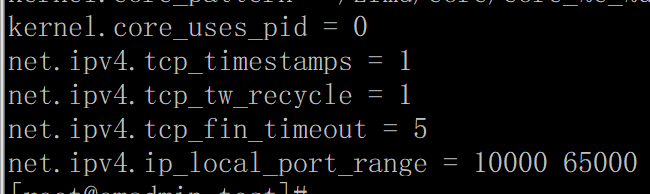

  如果输出没有上面最后4行内容则需要继续执行命令：`vim /etc/sysctl.conf` , 在文
件末尾添加如下内容并保存退出后, 最后用前面的命令再次确认。

```
    net.ipv4.tcp_timestamps=1
    net.ipv4.tcp_tw_recycle=1
    net.ipv4.tcp_fin_timeout=5
    net.ipv4.ip_local_port_range=10000 65000
```

2. 检查LD_LIBRARY_PATH环境变量是否设置并设置正确

  在终端里输入命令：` echo ${LD_LIBRARY_PATH}` 查看输出结果中是否有
/zfmd/wpfs20/lib 如果输入结果为空或者输出结果没有
“/zfmd/wpfs20/lib”这值值则系统环境设置有问题，需要重新设置此环境变量并重启
服务器才能开始部署scada软件。

</br>

> [返回目录](#目录)

</br>

### 1_2
### 软件发布

1.  将软件包“wpfs20.scada.版本号.tar.gz”拷贝到目录/zfmd/wpfs20/backup

2.  在/zfmd/wpfs20/backup目录下打开终端用命令解压软件包：
`tar –zxvf wpfs20.scada.版本号.tar.gz`

  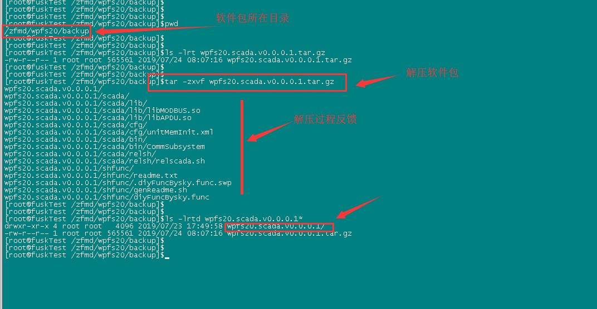

3.  解压后将会出现：“wpfs20.scada.版本号”的文件目录（文件夹），用命令进
入目录`cd wpfs20.scada.版本号/scada/relsh/`，执行命令`chmod u+x *.sh` 和
` ./relscada.sh` 进行软件自动部署。操作过程如下图所示：

  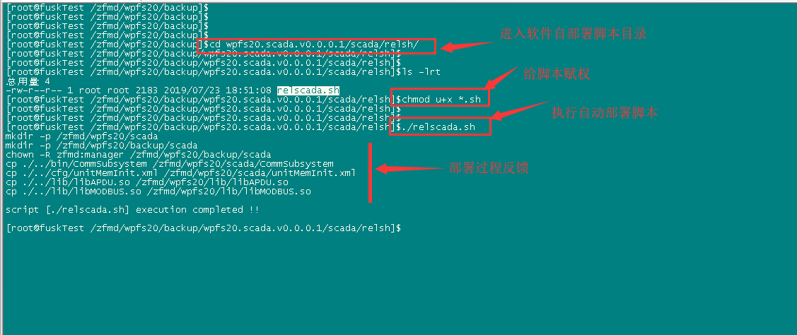

</br>

> [返回目录](#目录)

</br>

### 1_3
### 确认SCADA程序是否配置在自启动中

 > 注：系统中的自启动软件的部署是作为一个独立的软件规则的，如果系统中没有部署
自启动脚本软件，需要找到自启动脚本部署软件并按相关文件进行部署。

1. 用命令简单查看自启动脚本是否部署的方法如下：
`ls -l /zfmd/wpfs20/startup/proRunChk.sh` 查看文件是否存在 ，如存在则说明已经部署上了。

2. 在/zfmd/wpfs20/startup目录下打开终端执行如下图所示操作：

 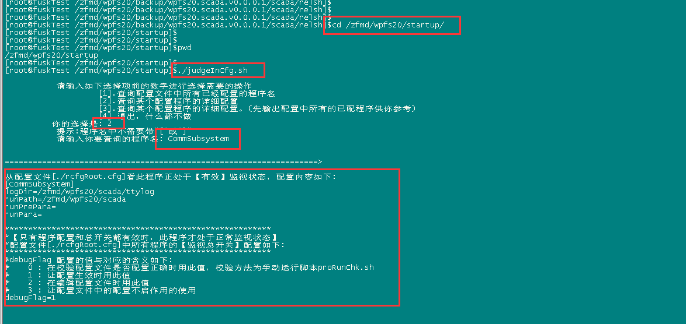

  如图所示的配置则为正常配置。

</br>

> [返回目录](#目录)

</br>

### 1_4
### 根据现场环境修改scada的ip和端口配置

scada采集各通道的ip和端口经常变动或者到现场后才能确定，因此scada对应此种情况开发
了一个较为方便修改scada的工具，详细操作过程如下：

1. 在/zfmd/wps20/scada下查看是否有 \*.cfg的文件。

 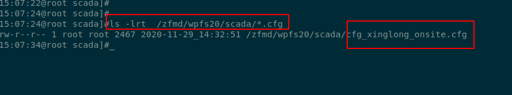

如果有，则打开此文件进行编辑， 文件内容类似如下：

```shell
#!/bin/bash
#date:2020-11-25_08:16
#dsc:设置scada配置文件中的ip，端口，设备id
#
#此风电场全名的：吉林通榆兴隆山 风电场
#吉林通榆兴隆山场scada的ip配置: 在现场修改如下ip时需要在/zfmd/wpfs20/scada下
#打开终端执行如下命令把此配置的ip修改到scada配置中去:
#   命令为:
#        opScdCfg.sh  set cdCfg.xml cfg_xinglong_onsite.cfg


#数据中心配置            
#入库                    
InlcalPort=5406                #scada采集数据入库时scada端的端口
InlcalIp="192.168.0.145"       #scada采集数据入库时scada端ip地址
InrmtPort=9009                 #scada采集数据入库时数据中心端的端口
InrmtIp="192.168.0.51"         #scada采集数据入库时数据中心端的ip地址
#出库                          
OutlcalPort=6407               #scada采集数据出库时scada端的端口
OutlcalIp="192.168.0.145"      #scada采集数据出库时scada端ip地址
OutrmtPort=9009                #scada采集数据出库时数据中心端的端口
OutrmtIp="192.168.0.51"        #scada采集数据出库时数据中心端的ip地址


#通道0 ModbusTcp采集测风塔1的数据
doChnNo[0]=0                           #通道号
index=${doChnNo[0]}                    #通道号索引
lclStnIP[${index}]="192.168.0.145"     #通道0,scada本地端ip (此值一般需要修改)
lclStnPort[${index}]=0                 #通道0,scada本地端口 (此值一般需要修改)
lclEquipID[${index}]=17                #通道0,设备编号（java平台报警用)
rmtStnIP[${index}]="192.168.0.99"      #通道0,scada远程端ip (此值一般需要修改)
rmtStnPort[${index}]=502               #通道0,scada远程端口 (此值一般需要修改)


#通道1 ModbusTcp采集测风塔2的数据
doChnNo[1]=1                          #通道号
index=${doChnNo[1]}                   #通道号索引
lclStnIP[${index}]="192.168.0.145"    #通道1,scada本地端ip (此值一般需要修改)
lclStnPort[${index}]=0                #通道1,scada本地端口 (此值一般需要修改)
lclEquipID[${index}]=18               #通道1,设备编号（java平台报警用)
rmtStnIP[${index}]="192.168.0.221"    #通道1,scada远程端ip (此值一般需要修改)
rmtStnPort[${index}]=502              #通道1,scada远程端口 (此值一般需要修改)


#通道2 104采集风机1期(1--33)33台风机的数据
doChnNo[2]=2                          #通道号
index=${doChnNo[2]}                   #通道号索引
lclStnIP[${index}]="192.168.0.145"    #通道2,scada本地端ip (此值一般需要修改)
lclStnPort[${index}]=0                #通道2,scada本地端口 (此值一般需要修改)
lclEquipID[${index}]=2                #通道2,设备编号（java平台报警用)
rmtStnIP[${index}]="192.168.0.154"    #通道2,scada远程端ip (此值一般需要修改)
rmtStnPort[${index}]=2404             #通道2,scada远程端口 (此值一般需要修改) 


#通道3 ModbusTcp采集风机2期(34--128)95台风机的数据
doChnNo[3]=3                          #通道号
index=${doChnNo[3]}                   #通道号索引
lclStnIP[${index}]="192.168.0.145"    #通道3,scada本地端ip (此值一般需要修改)
lclStnPort[${index}]=0                #通道3,scada本地端口 (此值一般需要修改)
lclEquipID[${index}]=3                #通道3,设备编号（java平台报警用)
rmtStnIP[${index}]="192.168.0.192"    #通道3,scada远程端ip (此值一般需要修改)
rmtStnPort[${index}]=502              #通道3,scada远程端口 (此值一般需要修改)


#通道4 104采集远动整场数据
doChnNo[4]=4                          #通道号
index=${doChnNo[4]}                   #通道号索引
lclStnIP[${index}]="192.168.0.145"    #通道4,scada本地端ip (此值一般需要修改)
lclStnPort[${index}]=0                #通道4,scada本地端口 (此值一般需要修改)
lclEquipID[${index}]=7                #通道4,设备编号（java平台报警用)
rmtStnIP[${index}]="192.168.0.119"    #通道4,scada远程端ip (此值一般需要修改)
rmtStnPort[${index}]=2404             #通道4,scada远程端口 (此值一般需要修改) 


#通道5 ModbusTcp转发远动测风数据
doChnNo[5]=5                          #通道号
index=${doChnNo[5]}                   #通道号索引
lclStnIP[${index}]="192.168.0.145"    #通道5,scada本地端ip (此值一般需要修改)
lclStnPort[${index}]=502              #通道5,scada本地端口 (此值一般需要修改)  
lclEquipID[${index}]=8                #通道5,设备编号（java平台报警用)
rmtStnIP[${index}]="192.168.0.154"    #通道5,scada远程端ip (此值一般需要修改)
rmtStnPort[${index}]=0                #通道5,scada远程端口 (此值一般需要修改)

```

 不同风场配置不一样，通道数也不一样，但其变量名都是一样，其中各变量意思见上文样例
文件中带#号的注释

2. \*.cfg文件修改完后，需要通过opScdCfg.sh工具把修改的值写入scada的最终配置文件
scdCfg.xml中去。

```shell
  #在/zfmd/wpfs20/scada/下打开终端执行如下命令
   opScdCfg.sh   set  scdCfg.xml   cfg_xinglong_onsite.cfg
  
  #其中scdCfg.xml为scada配置文件
  #    cfg_xinglong_onsite.cfg 是ip修改配置文件，各风场需要根据实际情况替换
```

3. 用run_scada工具重启scada让配置文件生效

```shell
    run_scada    --restart
```

  run_scada的其他功能及用户如下:

```shell
  run_scada [-h|--help] [--start] [--stop] [--restart]
            -h, --help        Show   help
                --start       Start  scada
                --stop        Stop   scada
                --restart     retart scada
```


> 注意: 新版scada有端口绑定功能,需要所有通道本地端的ip和端口都可用，否则
scada程序启动不起来。
>
>   但现场部署时有时为了调试某一个通道,但其他通道还未规划好，为了让scada
>   软件启动起来，可以把所有通道本地ip都设置成调试的本地ip即可!


</br>

> [返回目录](#目录)

</br>


## 2
## 典型问题定位

### 2_1
### 问题定位顺序参考

1.  确定数据采集的ip地址。

2.  知道了ip地址通过[3.1 opScdCfg](#3_1)
    查找对应通道号。

3.  查看采集通道对通道的网络连接是否正常
   （通过[3.2 ss_scada](#3_2)这个工具来查询）。   

4.  查看对应通道号是否有正常的报文（通过
    [3.3 msg_scada](#3_3)工具查询）。

5.  查看[3.5 val_scada](#3_5)工具查看对应通道的值是否正常。

6.  查看通道是否有明显错误信息（通过[3.4 err_scaa](#3_4)工具查询）。

7.  如果都正常则查看java前台界面的曲线是否正常。

通过如上步骤的的排查，一般都可以定位问题所在了。
  
</br>

> [返回目录](#目录)

</br>

---

### 2_2
### 常用命令

</br>

#### 2_2_1
#### nc命令

此命令在此文档主要来用是诊断网络连通性,具体到scada中主要用来测试scada作为主站，
远程站作为被动站（子站）时scada到子站固定端口的联通性，常用形式如下几种：

- 不带源地址和源端口的网络连通测试用命令:`nc 目标ip 目标端口` 

> ```shell
>     #eg:测试 当前主机到 42.121.65.50 这个机器 端口21是否连通
>     nc  -vz  42.121.65.50  21
> ```
> 返回结果类似如下图则说明是连通的:
>
> 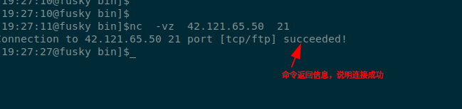


-   在某些环境中有防火墙则限制，需要有从固定ip或固定ip且固定端口连通目标ip与端口
    的网络连通测试用命令:

> ```shell
>     #eg:需要从固定源ip连通
>     nc -s 本地源ip地址   -vz 远程ip  远程端口
>     #eg:需要从固定源ip和固定源端口连通
>     nc -s 本地源ip地址 -p 本地源端口号  -vz 远程ip  远程端口
> ```
> 返回结果类似如下图则说明是连通的:
>
> 
>


</br>

> [返回目录](#目录)

</br>


## 3
## 各工具使用说明

**注意**:

  1. 如无特殊说明则各工具的使用都应在root用户下使用。
  2. 如果要退出输出信息界面只需要按`Ctrl + c`键即可。

</br>

---

### 3_1
### opScdCfg查询ip相关配置信息

首先在终端输入命令`which opScdCfg.sh`查看scada主机器是否有opScdCfg.sh工具

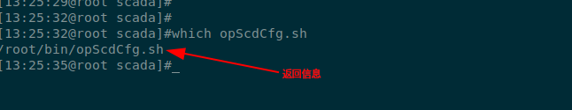

-   如图所示则表示在当前环境中有opScdCfg.sh工具，可以直接在终端中（无论什么路径
    下都可以）使用如下命令查询相应信息。

> ```shell
>    cd /zfmd/wpfs20/scada
>    #scdCfg.xml是配置文件名，可以根据实际情况修改
>    opScdCfg.sh prt scdCfg.xml
> ```
> 
> opScdCfg.sh prt scdCfg.xml 输出信息如下：
>
> 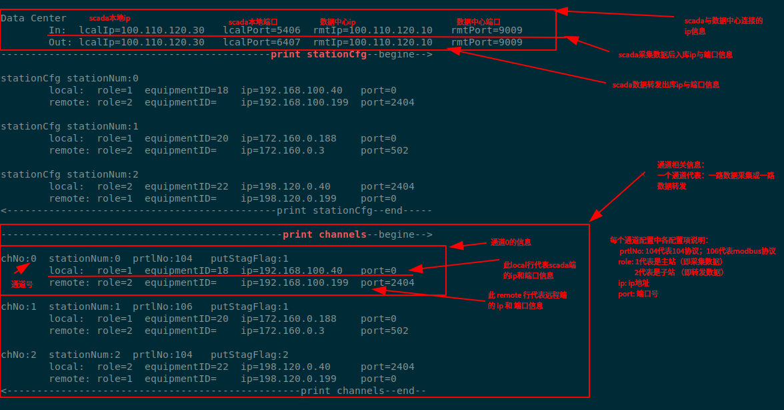
>
> 其中channels中包括的信息是通道相关信息是最常用到的。 

-   如果环境中没有opScdCfg.sh工具则可以在终端中输入如下命令打开scada配置文件
    查看对应通道ip配置：

> ```shell
>     cd /zfmd/wpfs20/scada
>    #scdCfg.xml是配置文件名，可以根据实际情况修改
>     gedit scdCfg.xml
> ```
> 在打开的文件中先查找channels节点：chnNum为通道号；然后查找对应channels节点下
> stationCfg节点为通道下ip配置
> 
> 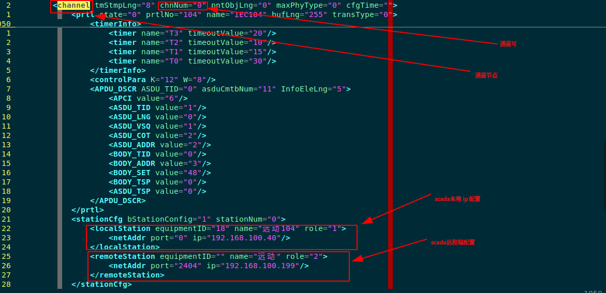
> 
> 如果当前查看通道配置下的ip不是要查找的ip则查找下一个channels节点直到查到为止。

</br>

> [返回目录](#目录)

</br>

---

### 3_2
### ss_scada网络连接查询

首先在终端输入命令`which ss_scada`查看scada主机器是否有ss_scada工具

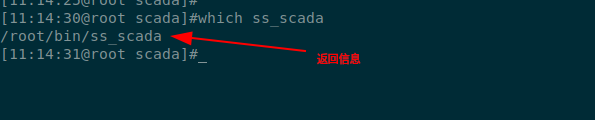

如图所示则表示在当前环境中有ss_scada工具，可以直接在终端中（无论什么路径下都可以）
使用`ss_scada`按回车键即可。

如果环境中没有ss_scada工具可以在终端中输入如下命令替代ss_scada工具：

```shell
    watch -n 2 -d 'ss -antp|grep CommSubsystem|grep -v "127.0.0.1"'
```

ss_scada输出信息包括，scada的`进程ID`,各通道网络连接情况，具体信息如下图所示：

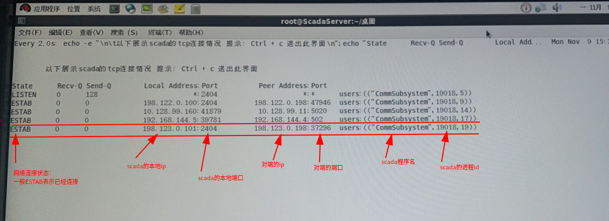

如果输出信息中没有对应ip信息则说明对应ip通道没有网络连接。


</br>

> [返回目录](#目录)

</br>

---

### 3_3
### msg_scada查看对应通道号的收发报文

首先在终端输入命令`which msg_scada`查看scada主机器是否有msg_scada工具

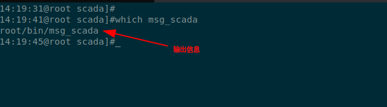

如图所示则表示在当前环境中有msg_scada工具，可以直接在终端中（无论什么路径下都可以）
使用`msg_scada 通道号`按回车键即可,其中的通道号可以通过[opScdCfg工具](#opScdCfg查询ip相关配置信息)查找对应
ip及ip对应的通道号来确定。

如果环境中没有msg_scada工具可以在终端中输入如下命令替代msg_scada工具：

```shell
    cd /zfmd/wpfs20/scada/trylog/
    # 在实际使用中0替换成要查找的通道号即可
    tail -f *.txt|grep "chnlNo=\[0\]"|egrep "(r::|s::)"
```

msg_scada的输出信息有时需要等待1分钟左右，当遇到此信息时知道是正常情况即可，
具体信息如下图所示：

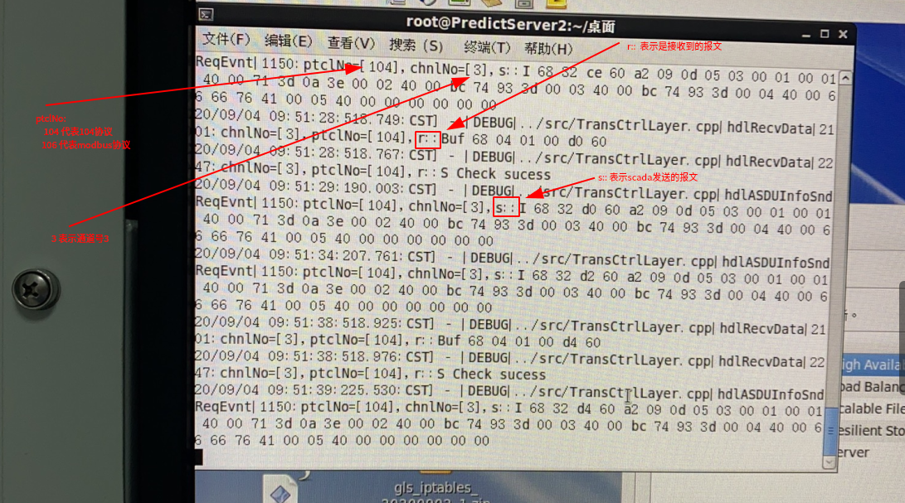

上图的示例是输入`msg_scada 3`后的输出。


</br>

> [返回目录](#目录)

</br>

---

### 3_4
### err_scada查看scada错误信息

首先在终端输入命令`which err_scada`查看scada主机器是否有err_scada工具

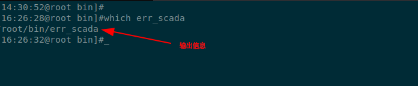

如图所示则表示在当前环境中有err_scada工具，可以直接在终端中（无论什么路径下都可以）
使用

(1). `err_scada 通道号`按回车键查看某个通道的错误信息,其中的通道号可以通
     过[opScdCfg工具](#opScdCfg查询ip相关配置信息)查找对应ip及ip对应的通
     道号来确定。

(2). `err_scada`按回车键查看scada的所有错误信息。

如果环境中没有err_scada工具可以在终端中输入如下命令替代err_scada工具：

```shell
    cd /zfmd/wpfs20/scada/trylog/
    # (1)查看某个通道的错误，在实际使用中0替换成要查找的通道号即可
    tail -f *.txt|grep "chnlNo=\[0\]"|grep "ERROR"
    # (2)查看所有的错误
    tail -f *.txt|grep "ERROR"
```

err_scada的无输入信息则表示无信息信息（如果有错误信息大多一1分钟内就会有输出）

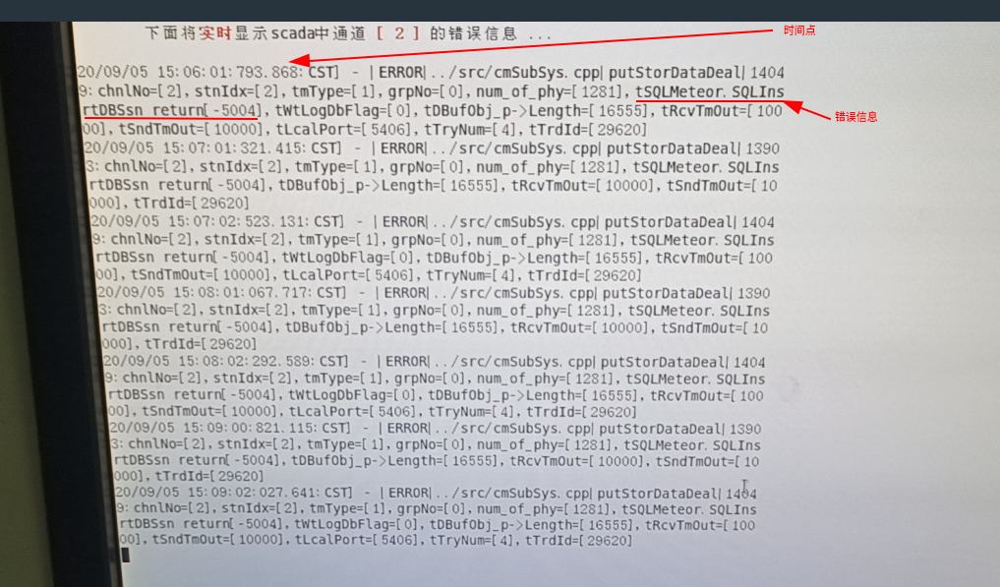

上图的示例是输入`err_scada 2`后的输出。


</br>

> [返回目录](#目录)


</br>

---

### 3_5
### val_scada查看scada通道收或发值

首先在终端输入命令`which val_scada`查看scada主机器是否有val_scada工具

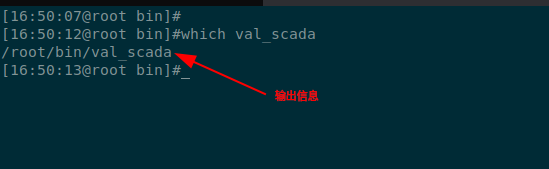

如图所示则表示在当前环境中有val_scada工具，可以直接在终端中（无论什么路径下都可以）
使用`val_scada 通道号`按回车键查看某个通道的收或发值信息,其中的通道号可以通过
[opScdCfg工具](#opScdCfg查询ip相关配置信息)查找对应ip及ip对应的通道号来确定。

val_scada的输出信息有时需要等待1分钟左右，当遇到此信息时知道是正常情况即可，
具体信息如下图所示：

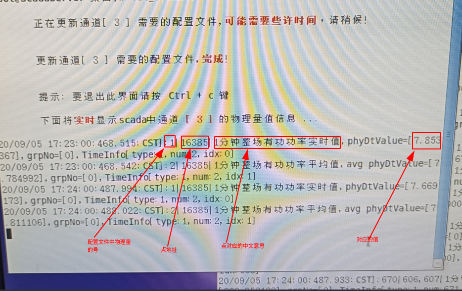

上图的示例是输入`val_scada 3`后的输出。

***TIPS:如果某个通道0值太多可以输入命令`val_scada 通道号 "nonull"`查看非0值输出***


</br>

> [返回目录](#目录)

</br>

